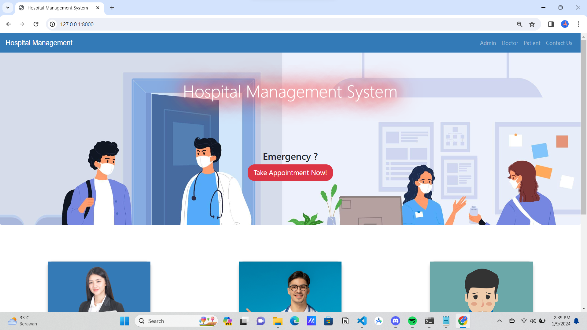
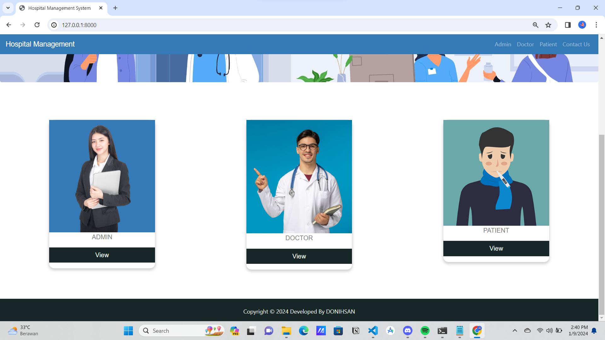
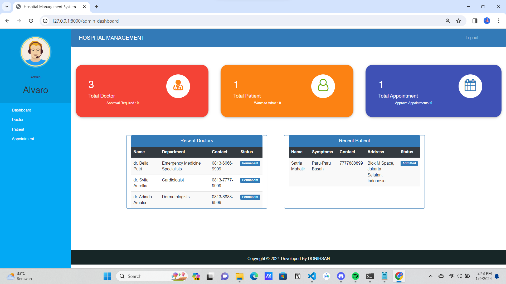
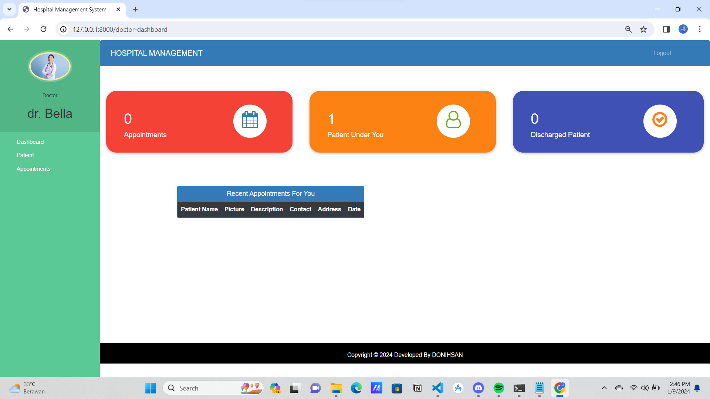
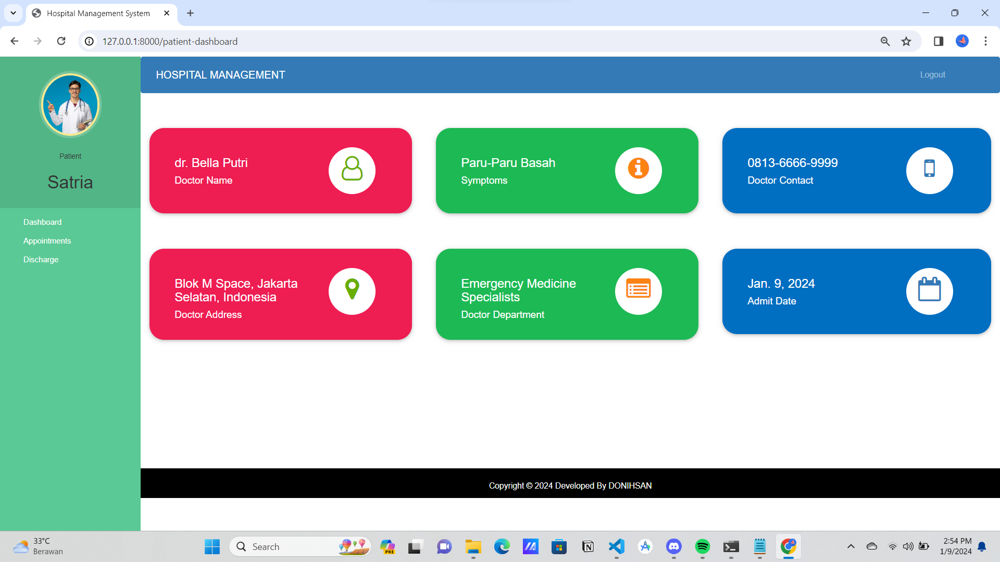

# Hospital-Management-System 👨‍⚕️

## Anggota Kelompok

|**Nama**|**NIM**|**Kelas**|**Matkul**|
|----|---|-----|------|
|Muhammad Ikhsan Fakhrudin|312210019|TI.22.A.2|Object Oriented Programming|
|Muhammad Fiqri Setyoadi|312210062|TI.22.A.2|Object Oriented Programming|
|Muhammad Verdy Hasan|312210241|TI.22.A.2|Object Oriented Programming|
|Fergiawan Satrio Bagaskoro|312210169|TI.22.A.2|Object Oriented Programming|

## Instructions

- Install the Requirements : ``pip install -r requirement.txt``

- Then, make database migrations : ``python manage.py makemigrations``

- ``python manage.py migrate``

- And finally, run the application : ``python manage.py runserver``

***For Admin Account, please create one with superuser!***

## Screenshots

***Tampilan Home Page :***

***Tampilan Dashboard Admin :***

***Tampilan Dashboard Dokter :***

***Tampilan Dashboard Pasien :***

## SELESAI  